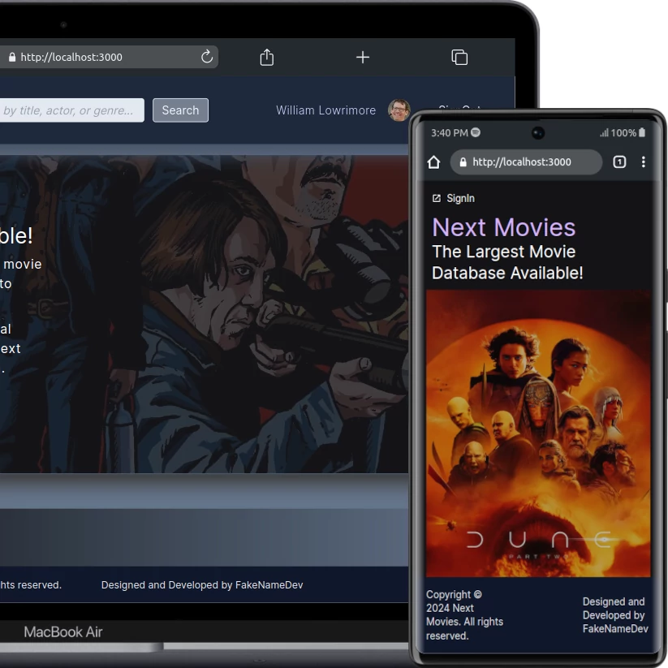

# Next Movies Frontend MVP

### React | Next.JS 14 | TailwindCSS | TMDB API

Welcome to my Frontend Movie App. This app uses the above mentioned technologies along with NextAuth and React Context API. The user can sign-up and Sign-in via Google to create a user session with JSON Web Tokens (JWT). The token is stored and fetched from the users&apos; own localStorage. They can then search for movies &#40; tv shows available in future development &#41;. There is also a 7-day free trial pop-up modal that will save a token in future development.
 
 
Don&apos;t have a Google account? No worries. A username and password is hardcoded for those without Google access. Those credentials are:
 
 
username: My Friend 
password: password123
 
 

 
 
You can view the live site on [vercel]()

### Contact:

[www.williamlowrimore.com](https://www.williamlowrimore.com) 
[william-lowrimore-dev](https://www.linkedin.com/in/william-lowrimore-dev) 
[wlowrimore@gmail.com](mailto://wlowrimore@gmail.com)
